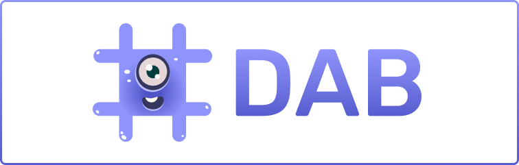

Welcome to DAB's documentation. DAB is an open internet service for canister, NFT, Token, and Dapp registries/lists any interface can consume, making assets and canisters easily discoverable, with metadata that makes them descriptive and human-readable, as well as quality assurance for risk reduction in the ecosystem (e.g reduce phishing).

- Visit [our website](https://dab.ooo)
- Visit [our main repository](https://github.com/psychedelic/dab)
- Visit [DAB-js repository](https://github.com/psychedelic/dab-js)

!!! Important

    DAB is currently in its V0.1.0. This version includes the NFT list/registry only. The Token, Canister, and Dapp list services will follow soon after, but early applications for these lists are being collected (find the forms in the menu),

## Getting Started with DAB

Want to connect your app to **DAB's NFT list** to auto-surface NFT collections and easily integrate multiple assets and standards at once in your UI/app?

- [Check out our getting started guide for the NFT list.]()
- [Get familiar with the DAB-JS library.]()

As a summary, to integrate DAB's NFT list you need to do two things. First, you will interact with the actual **DAB NFT List canister**, to query the available list and metadata. As of V0.1.0, you can:

- Pull a list of NFT collections, and their Canister IDs
- Show the project’s metadata (name, image, etc)
- See the type of standard it uses (ICPunks, EXT, etc.) 

The second step is to use the **DAB JS library** to make calls to these NFTs (transfer, etc.) This library, in a nutshell, is a wrapper that provides the necessary tools/methods to interact with the different standards and collections available in DAB.