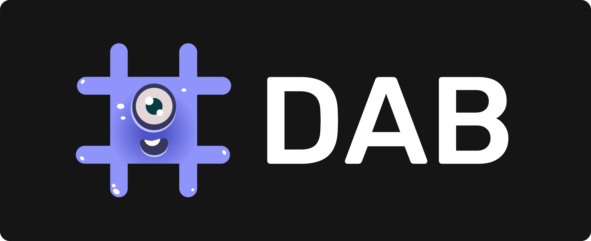

# Welcome to DAB 👋

Welcome to DAB's documentation. DAB is an open internet service for data on the IC. All the data an IC app needs to make a seamless experience, accessible directly on the IC. DAB is an open internet service for NFT, Token, Canister, and Dapp registries.

- Visit [our website](https://dab.ooo)
- Visit [DAB's main repository](https://github.com/psychedelic/dab)
- Visit [DAB-js repository](https://github.com/psychedelic/dab-js)

!!! Important

    DAB is currently in its V0.2.0. This version includes the NFT list and the Canister list. The Token and Dapp list services will follow soon after, but early applications for these lists are still being collected (find the forms in the menu)

## #️⃣ V0.2.0 - DAB's Current Registries.

In v0.2.0, DAB has two registries that developers can integrate with, or submit items to:

- The NFT List (auto-surface NFTs in apps and multi-standard support).
- The Canister List (associate metadata to Canister IDs and auto-surface it in UIs)

## 🎨 The NFT List

**The NFT list** DAB provides a list of NFTs that apps & developers can **consume to surface new NFTs as they are listed in DAB, instead of manually adding them one by one**.

DAB's NFT list is **standard agnostic** and through the DAB-js library, developers can easily integrate and make calls to any NFT collection on the list regardless of their NFT standard interface (EXT, Departure Labs, etc.), **because in its library DAB wraps all standards into a common javascript interface**.

> Want to submit an NFT collection so its listed in DAB for apps to auto-surface? See below!

### 🧰 Getting Started with DAB - the NFT List

Want to connect your app to **DAB's NFT list** to auto-surface a user's NFT collections and easily integrate multiple assets and standards at once in your UI/app?

To interact with DAB's services you need to use the DAB-js library. Read our documentation or visit the DAB-js repository to get started.

- [Read our getting started guide](https://docs.dab.ooo/nft-list/getting-started/)
- [DAB-js library - Repository](https://github.com/psychedelic/dab-js)

### 🖌️ Current NFT List & Making New Submissions
You can see the current listed NFT collections in the link below. **Want to submit a new NFT collection to the list? Use the form below.**

- [View the current NFT Collection List📜](https://github.com/Psychedelic/dab/blob/main/registries/nft/list.json)
- [Submit a new NFT to the list 📫](https://dab-ooo.typeform.com/nft-list)

## 🛢️ The Canister List

**The Canister List** is a canister registry where you can associate Canister IDs to a metadata profile (name, front-end URL, description, logo...) to make them more discoverable by UIs. 

Apps that show Canister IDs in their UIs/apps can **integrate to the Canister List** to check if that Canister ID has associated metadata, and display it for their users to see in a more descriptive and human-readable way.

- It helps make Canister ID human-readable and identifiable.
- It helps give users information to judge whether to trust a canister or not
- It can help in the future to identify duplicates or impersonations.

[**View the Canister Registry Source Code**](https://github.com/Psychedelic/dab/tree/main/registries/canister_registry)

### 🖌️ Submitting/Adding a Canister ID to the Canister List

Want to submit a new Canister ID to the registry to associate metadat to it, and have integrated apps auto-surface it? Use the form below.

- [**Current List**](https://github.com/Psychedelic/dab/blob/main/registries/canister_registry/list.md)
- [**Submit a new Canister to the list 📫**](https://dab-ooo.typeform.com/canister-list)

For V0.2.0, the review process for submissions is manual and done by the DAB core team; in the future we will automate the process, and migrate to a community-governed and trustless system.

**We are exploring an automated way of adding Canister IDs and their metadata to the registry**. The main issues are confirming the controller is the one submitting it, and then adding a verification layer to avoid duplicates/phishing/impersonation.

### 🧰 Start Integrating DAB's Canister List into your App

To interact with DAB's services you need to use the DAB-js library. Read our documentation or visit the DAB-js repository to get started.

- [Read our getting started guide](https://docs.dab.ooo/canister-list/getting-started/)
* [**DAB-js library - Repository**](https://github.com/psychedelic/dab-js)
---

## 📬 Coming Next: Token, and Dapp lists (Early Applications)
After V0.1.0, we'll be working on token, and Dapp registries. These are still in development, **but we are receiving early submissions to be added to these lists on release**.

- [Token List](https://dab-ooo.typeform.com/token-list)
- [Dapp List](https://dab-ooo.typeform.com/dapp-list)