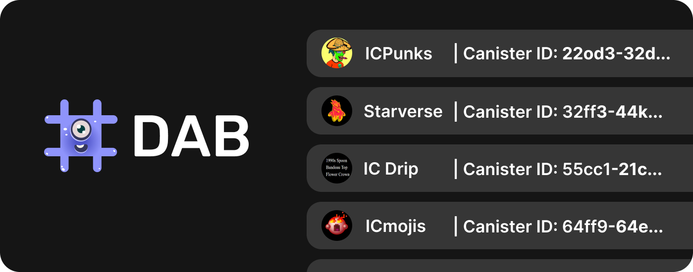

# 🖌️ Getting Started - Integrate the NFT List




All right! Ready to integrate DAB's NFT list into your app? Your main point of interaction for interacting with DAB is the **[DAB-js library](https://github.com/Psychedelic/DAB-js/)**, which we built to provide a simple plug-n-play way of integrating DAB. With it, you will:

1. Query DAB's NFT Collection List to get an Array of the NFTs a user (Principal) owns.
2. Use the DAB-js standard interface wrapper to interact with listed collections (transfer, check a user's owned nfts, get details, etc.)

**Let's do a double click on that last point**. The list is standard-agnostic, meaning NFT collections from different NFT standards are available (ICPunks, EXT standard, etc.). To facilitate your integration to them, the **DAB-js library wraps all of the standards listed in DAB** into a **common javascript interface**. Instead of calling different methods, depending on the standard, you use DAB's common interface, and let DAB translate the calls.

---

## 1. 🧰 Setting up DAB-js in your project

First, you need to install the DAB-js **npm package** into your project.

You can do so from the command line:
```js
npm install @psychedelic/dab-js@0.1.6
```

Or via the package.json:
```js
"@psychedelic/dab-js": "0.1.6"
```

## 2. 🎨 Fetching All NFTs the User Owns (getAllUserNFTs method)

In this step, you will use the getAllUserNFTs method to get an array with all the NFTs (and their details) the user (a Principal ID) owns. 

Here, DAB takes the identity you pass, and checks in every NFT collection currently on the DAB list (ICPunks, Starverse, etc...) for the individual assets the user owns (Punk#1230).

You need to pass:
- An agent (an Http agent, instantiated with agent-js or Plug)
- A Principal object (a user's Principal ID instantiated as a principal object)

```js
import { Principal } from '@dfinity/principal';
...
const getNFTCollections = async () => {
  const principal = 'r4rmh-mbkzp-gv2na-yvly3-zcp3r-ocllf-pt3p3-zsri5-6gqvr-stvs2-4ae';
  const collections = await getAllUserNFTs(
    agent,
    Principal.fromText(principal)
  );
}
getNFTCollections();
```

This call will return an array that includes an NFTCollection interface with the details of each NFT Collection where a user owns an NFT (name, canister id, standard, tokens).

Inside that interface the **tokens object** includes an array with each individual NFT the user owns in the collection (e.g Punk#), and its details (index, canister, id, name, url, metadata, standard, collection). This is **all the data you need to surface in the UI for your user.**

```js
const getAllUserNFTs = async (
  agent: HttpAgent,
  user: Principal
): Promise<Array<{
  name: string;
  canisterId: string;
  standard: string;
  tokens: Array<{
    index: bigint;
    canister: string;
    id?: string;
    name?: string;
    url: string;
    metadata: any;
    standard: string;
    collection?: string;
  }>;
}>>
```

Here's a more detailed breakdown of each interface the array returns for clarity:

```js
interface NFTDetails {
  index: bigint;
  canister: string;
  id?: string;
  name?: string;
  url: string;
  metadata: any;
  standard: string;
  collection?: string;
}

interface NFTCollection {
  name: string;
  canisterId: string;
  standard: string;
  tokens: NFTDetails[];
}

const getAllUserNFTs = async (
  agent: HttpAgent,
  user: Principal
): Promise<NFTCollection[]>
```

## 3. 🌯 Triggering a Transfer for an NFT (transfer method)

(pending)
