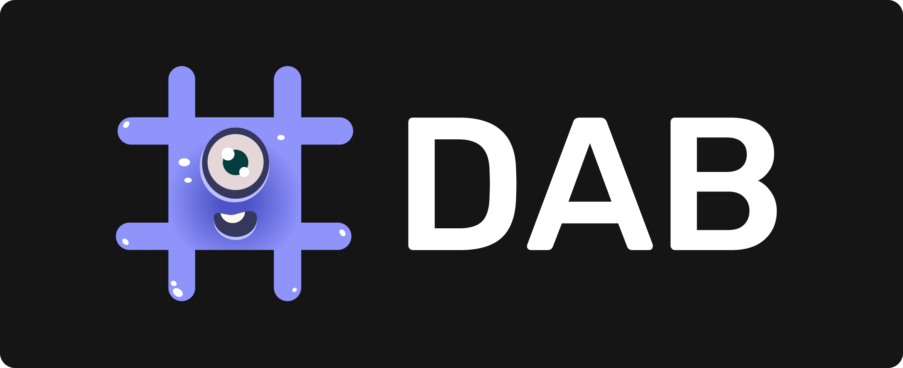

# Why use DAB? 🤔

DAB is an open internet service for NFT, Token, Canister, and Dapp registries that app can consume to auto-surface a user’s assets, names of canisters they are interacting with, and metadata in their user interface. Making assets and canisters easily discoverable, with metadata that makes them descriptive and human-readable (and safer to interact with).

----

## Why use DAB? It provides two clear benefits:

### 1. **Benefits for Tokens, NFTs, Canisters:** 

If you list your canister, NFT, Token, or Dapp in DAB's lists, it means it can be easily discoverable, surfaceable, and integrated by all UIs and applications that use DAB. **Automagically integrated and supported**, and visible to anyone on our public lists.

In the case of the Canister List, if you list your canisters you can increase the **trust behind it** by providing clear metadata that interfaces can surface to help users identify the canister's purpose and objective. It creates "canister profiles" with rich metadata that can better explain what your canister does, and help differentiate malicious actors.

----

### 2. **Benefits for UIs/Apps/Interfaces:** 

For UIs and apps, DAB is an easy way to surface and integrate NFTs & Tokens **without having to build custom integrations per-asset or standard**, as well as auto-surface descriptive metadata for canister IDs to better inform users.

Instead of integrating NFTs and Tokens of different standards separately, through DAB they can integrate a list that automatically grows as new assets are listed, using a library **that normalizes different standards into a common interface**. No need to add NFTs & Tokens individually, all can be fetched at onces programmatically.

In the case of the Canister List, UIs can integrate it to surface **metadata for users regarding the different canisters that they interact with**. UIs can query the Canister List for a Canister ID, and if it has a record they can fetch a descriptive name, logo, and description and relevant URLs related to the project that **they can then surface for users in their UIs**.

